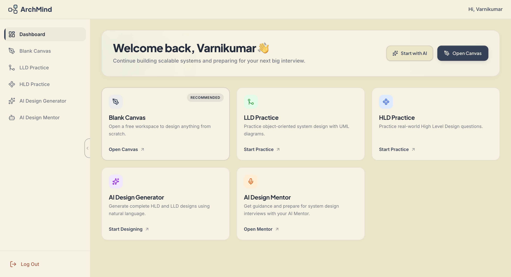

# ArchMind 🧠

ArchMind is an advanced, AI-powered System Design Interview simulator and Architecture diagramming platform. Built for software engineers, it merges a powerful drawing engine with an Abstract Syntax Tree (AST) graph parser and an AI mentor to evaluate your technical designs in real-time.



## 🚀 Core Features

ArchMind is built around **5 core modules** designed to take you from basic whiteboarding to production-grade system architecture.

### 1. 🎨 Blank Canvas
A distraction-free, lightning-fast whiteboard powered by Excalidraw. 
- Infinite canvas for freeform brainstorming.
- Perfect for raw sketching before committing to strict architectures.

### 2. 🏗️ LLD (Low-Level Design) Canvas
An object-oriented design environment built for UML.
- Generate Class, Interface, Object, Activity, and Sequence diagrams.
- **Smart Parsing**: The canvas automatically extracts mathematical graphs from your visual lines (Inheritance, Aggregation, Composition).
- **Code Generation**: Convert your visual LLDs directly into working boilerplate code.

### 3. ☁️ HLD (High-Level Design) Canvas
A premium cloud architecture workspace.
- **50+ Industry-Standard Components**: Kafka, Kubernetes, Load Balancers, Redis, API Gateways, and more.
- **Smart Protocol Edges**: Visually map gRPC, WebSockets, and HTTP connections.
- **Visual Profiler**: Programmatically detects bottlenecks and paints Single Points of Failure (SPOFs) in red directly on your canvas!

### 4. 🤖 AI Design Mentor
Your personal Principal Engineer, living in the sidebar.
- **Context-Aware Streaming Chat**: The AI sees your entire canvas graph in real-time.
- **Granular Evaluation**: Receive strict grading on Scalability, Reliability, Security, and Data Management.
- **History Snapshots**: Automatically saves the state of your canvas alongside your chat history for easy resume.

### 5. ⚡ AI Design Generator *(Coming Soon)*
Describe a system in plain English, and watch ArchMind construct the complete HLD and LLD diagrams right before your eyes. 

---

## 🛠 Tech Stack

- **Frontend**: Next.js 15 (App Router), React 19, TailwindCSS v4, Framer Motion
- **Diagramming Engine**: Excalidraw, custom AST extraction algorithms
- **AI & LLM**: Vercel AI SDK, Groq (Llama-3/Mixtral)
- **Backend/DB**: Next.js Serverless Routes, MongoDB (Mongoose)

---

## 📁 Folder Structure

```text
ArchMind/
├── src/
│   ├── app/                    # Next.js App Router (Pages & API Routes)
│   │   ├── api/ai/             # AI endpoints (Chat, Mentor, Reviews)
│   │   ├── dashboard/          # The core application dashboards (HLD, LLD, Blank)
│   │   └── page.tsx            # Landing Page
│   ├── components/
│   │   ├── canvas/             # Core Whiteboard & Excalidraw wrappers
│   │   │   └── plugins/        # Domain-specific logic (HLD, LLD)
│   │   ├── layout/             # Shared Layouts (Navbar, Sidebar)
│   │   └── ui/                 # Reusable UI components
│   ├── models/                 # MongoDB Mongoose schemas
│   ├── services/
│   │   └── ai/                 # Prompts, LLM tools, and AI Providers
│   └── styles/                 # Global CSS and Tailwind configs
├── public/                     # Static assets (SVGs, icons, images)
└── package.json
```

---

## ⚙️ Getting Started

Follow these steps to run the project locally.

### 1. Clone the repository
```bash
git clone https://github.com/Varni1512/ArchMind.git
cd ArchMind
```

### 2. Install dependencies
```bash
npm install
```

### 3. Set up environment variables
Create a `.env.local` file in the root directory and add your API keys:
```env
# Database
MONGODB_URI=your_mongodb_connection_string

# AI Provider (Groq / OpenAI)
GROQ_API_KEY=your_groq_api_key
```

### 4. Run the development server
```bash
npm run dev
```

Open [http://localhost:3000](http://localhost:3000) with your browser to see the result.

---

## 🤝 Contributing
Contributions, issues, and feature requests are welcome!

## 📝 License
This project is licensed under the MIT License.
